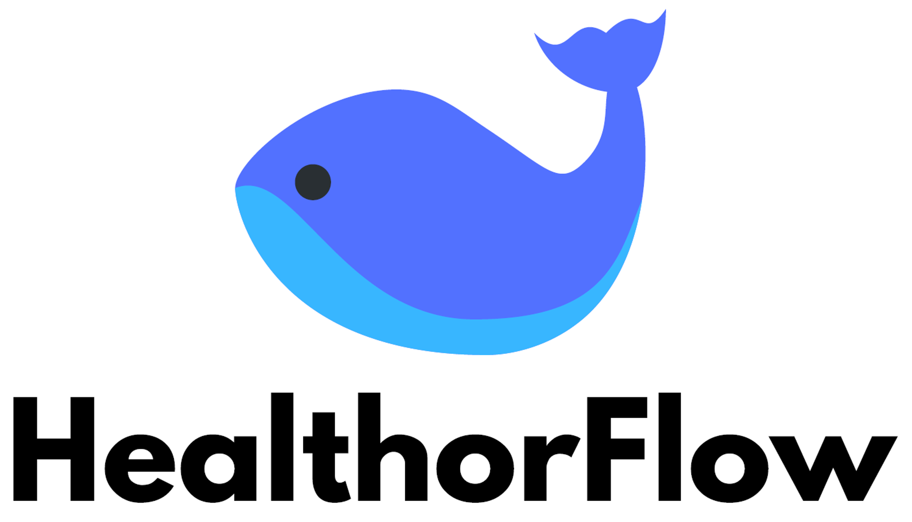
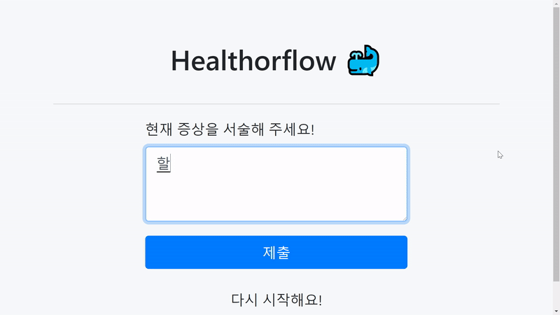

# KPMG Healthorflow
<!-- {: width="50%" height="50%"} -->

자연어처리 기반 챗봇을 활용한 '더 똑똑한' 의학 커뮤니케이션  

(서비스 데모 웹페이지 : http://ad2d969e.ngrok.io)

## Introduction
팀 `Healthorflow`는 대형 병원의 고질적인 문제인 **비효율적인 예약 및 진료/대기 시스템**에서 낭비되는 시간을 줄이기 위해 개발된 서비스입니다.  

상급병원을 이용할 경우, 우선 전화 혹은 인터넷을 통해 병원의 담당 직원에게 증상을 설명해야 합니다. 그 후 관련 인력의 판단에 따라 진료과가 배정되고, 병원에 방문해 번호표를 뽑은 후 대기를 거쳐 진료실에 입장합니다. 그러나 긴 대기 시간을 거친 후에도, 정작 본 진료는 5분도 채 되지 않습니다. 또한, 증상 관련 기초 서술에 상당한 시간을 할애해야 하기에 진료 시간은 더욱 더 비효율적으로 사용됩니다.

이와 같이 **예약-대기-진료**의 순서로 진행되는 대형병원 시스템에서는 아래와 같은 세 가지 비효율성의 문제가 발생합니다.

	1) 환자들의 최초 예약 신청과 진료과 배정 사이에 소요되는 시간
	2) 진료시 환자들이 기본적인 증상만을 서술하는데 소요되는 시간
	   (전체적인 진료 시간 증가로 이어지기에 대형 병원 운영 비효율화의 핵심적인 원인)
	3) 장시간 대기하는 과정에서 발생하는 고객 불만(VoC)

과연 일련의 문제들을 데이터 과학을 통해 해결할 수 있다면 어떨까요? `Healthorflow`는 자연어처리와 머신러닝을 활용해 병원 예약에서 진료까지, 낭비되던 시간들을 효율적으로 줄일 수 있는 솔루션입니다.

저희 서비스는 환자가 자유롭게 서술한 자신의 증상 텍스트에서 **주요 증상**을 추출하고, 그 후 해당 증상과 가장 관련성이 큰 **의료인에게 배치**시킵니다. 이후 대기 과정에서 추출된 주증상에 대한 **문진형 챗봇**이 실행되어, 진료실에 입장하기 이전에 담당의가 환자에 대한 기초적인 정보를 확보할 수 있게끔 합니다.  

즉, `Healthorflow` 서비스를 사용하게 된다면,

	1) '환자'는 긴 대기시간을 기다릴 필요 없이 증상 서술만으로 병원 예약이 가능해집니다.
	    덕분에 진료시간동안 효율적으로 필요한 질문들을 할 수 있게 됩니다.
	2) '의사'는 기초 문진을 생략할 수 있게 되어 좀 더 환자에게 집중할 수 있습니다.
	3) '병원'은 불필요한 인력과 시간을 줄일 수 있으며, 환자에 대한 데이터를 정형화해서 축적할 수 있으므로 이를 
	   대규모 데이터 분석에서 추후에 활용할 수 있습니다.

저희 팀은 웹 상에 공개된 데이터만으로 10가지 주증상 추출에 대해 F1-Score 기준 **92.4%의 정확도**를 가지는 프로토타입 모델을 만드는데에 성공했습니다. 만약 실제 병원과 협력해 내부 의료 데이터를 활용해 개발을 진행할 수 있다면, 모델의 성능은 대폭 개선될 것으로 예상됩니다.

현재, 삼성서울병원과 컨택해 예약 자동화 관련 서비스 개발을 논의 중에 있습니다.

## Demo

<!-- 천재 수학소년이 데모 페이지 링크를 공유할 자리 -->

## Task Description
### 1. 데이터 수집(Data Scraping)
**데이터 수집 단계**에서는 환자들이 증상에 대해 자신의 언어로 직접 자유롭게 서술한 텍스트를 확보하고, 이를 증상명과 일대일로 대응(matching)시키는 것이 일차적인 목표입니다. 이를 위해 *(1)기침, (2)콧물, (3)복통, (4)변비, (5)설사, (6)흉통, (7)호흡곤란, (8)두근거림, (9)어지러움 (10)두통*의 10가지 증상에 대해 **네이버 지식iN** 의학 답변과 건강의학포털 **HiDOC** 두 곳의 웹사이트에서 데이터를 수집했습니다.  

검색 쿼리(query)로 '가슴이 두근', '가슴이 아파' / '두통', '어지러워', '머리가 아파' 등을 입력한 후 이에 대응되는 질문들의 텍스트 본문을 수집하는 형태로 데이터 수집이 진행되었습니다. 각 쿼리(query)에 대해 약 5,000개의 질의응답 데이터를 수집할 수 있었으며, 활용한 툴은 *BeautifulSoup*과 *Selenium*입니다. 수집 코드 및 결과 데이터는 `web_crawling` 폴더에서 확인할 수 있습니다.

### 2. 자연어 처리를 활용한 한글 임베딩(Hangul Embedding with NLP)
적은 컴퓨팅 자원으로도 빠르게 임베딩을 계산하고, 또 온라인 접수 시에 발생하기 쉬운 오타에도 유연할 수 있는 방향으로 한글 임베딩을 계산하였습니다. 우선 **자모(subcharacters)** 단위로 활자들을 분리한 후 (ex. 두통 -> ㄷㅜEㅌㅗㅇ),  단어를 구성하는 하위 어휘들(subwords) N-gram에 대해 임베딩을 학습하는 **FastText**를 적용하였습니다. 학습된 임베딩의 전체 차원은 200차원입니다.

### 3. 머신러닝을 활용한 분류모델 (Query Prediction Model with Machine Learning)
환자가 입력한 텍스트를 앞의 방식을 통해 임베딩 벡터로 변환한 후, 10가지 주증상 중 하나로 분류하는 다중클래스 분류 모델(multiclass classification model). 기초 모델(baseline)로는 부스팅 알고리즘 중 하나인 **XGBoost**를 활용했으며, 이에 **베이지언 최적화(Bayesian Optimization)** 를 추가한 후 최종적으로는 **심층신경망(Deep Neural Network)** 모형과 앙상블하여 최종 모델을 선정했습니다. 분류 알고리즘 코드는 `classifier` 폴더에서 확인할 수 있습니다.

주요 모델의 정확도는 아래와 같으며 최종 분류 모델의 성능은 **F1-Score 92.4**입니다.

Model                                        | F1-Score        |
-------------------------------------------- | :-------------: | 
XGBoost                                      | 81.2%           | 
XGBoost with Bayesian Optimization           | 89.2%           | 
Ensembled Model with DNN & Optimized XGBoost | **92.4%**       | 

### 4. 규칙 기반 챗봇 문항 개발 (Rule Based Chatbot Questionnaire Development)
문진 챗봇은 진료 시 환자를 평가하기 위한 기본 적인 정보를 빠르게 파악하는 것을 목표로 합니다. 이와 같이 환자들에게서 파악해야 할 의학적으로 중요한 정보들을 얻는 문진 과정은 **규칙 기반(rule-based)** 으로 개발되었습니다. 사전에 분류해 둔 주요 증상별 필수 질문을 트리 구조 형태로 작성하였으며, 의사 국가고시 실기 시험 중 모의 진료 항목인 **CPX**를 바탕으로 합니다. CPX는 의사가 되기 위해 통과해야 하는 시험으로 일차 진료 상황에서 환자를 처음 접할 때 반드시 수집해야 하는 정보들을 제대로 파악할 수 있는지를 평가하는 시험입니다. 가령 복통을 호소하는 환자의 경우 증상의 발현 시점, 통증의 심한 정도, 지속 기간, 시간에 따른 변화 양상, 동반 증상, 과거력, 가족력 등에 대해서 반드시 물어보게 되어있습니다. 이 과정에서 이전 질문에 대한 환자의 응답에 따라 향후 질문이 상이한 경우가 많았기에 트리 구조의 형태를 사용하였습니다.

### 5. 웹페이지 개발 (Web Development)
기술 시연을 위한 UI를 범용성과 생산성이 가장 높은 웹앱으로 구현하였습니다. 신속하고 신뢰성 있는 개발을 위해 입증된 범용 프레임워크인 **jQuery**와 **Bootstrap v4.0**을 조합하였습니다. 반응형 UI 개발로 모바일과 PC, 태블릿 환경에서 모두 테스트 가능한 범용성을 확보하였습니다. 향후 사업 확장 시에 모든 스마트폰이나 태블릿의 네이티브 환경에서 사용될 수 있도록 **React Native**로 구현할 계획입니다.  

챗봇과 언어를 통일하기 위해 챗봇이 쓰인 파이썬 언어로 서버를 구현하였습니다. 서버는 **Flask** 프레임워크를 기반으로 만들어졌습니다. 로직이 이후에도 재활용될 수 있도록 REST API의 규약을 준수하였습니다.

## Team Members & Role
### Data Scraping
- 진승욱 (KAIST 경영공학 석사과정)
- 황유진 (KAIST 경영공학 석사과정)
### NLP & ML
- 강태영 (KAIST 경영공학 석사과정)
- 장준규 (KAIST 경영공학 석사과정)
### Chatbot Design
- 김윤재 (울산대 의학)
- 김진하 (서울대 의학)
### Web Development
- 장준규 (KAIST 경영공학 석사과정)
